# Quick Panel Background Cropper

Create Samsung Good Lock Quick Panel background PNGs for the Controls panels from a single image.

## What it does

This app helps you turn one wallpaper or photo into the square panel images used by Samsung Good Lock's Quick Panel customization.

In v2, this app only supports the Quick Panel **Controls** tab. That means it
currently covers these four panels only: Button box, Media player, Brightness,
and Volume.

It includes:

- Default and Advanced layout customization modes
- one-time Quick Panel calibration using a screenshot
- live preview for Button box, Brightness, Volume, and Media player
- pan and zoom adjustment before export
- PNG export in the same order you need to apply them in Good Lock

## Target devices

This app is only intended for:

- Samsung phones
- Android 16
- One UI 8.5
- mainly Galaxy S series and A series slab phones

## Current scope

One UI 8.5 Quick Panel customization has separate areas such as **Controls**
and **Buttons**. This app currently supports only the four customizable
**Controls** panels:

- Button box
- Media player
- Brightness
- Volume

The Quick setting **Buttons** panels such as WiFi and Bluetooth are not part of
v2 yet. They are planned for v3 or later, which is why the app currently lets
you export only four panel images instead of the full Quick Panel set.

Not intended for:

- Fold, Flip, or tablets
- DeX or external-display layouts
- older or different One UI versions
- Quick setting Buttons customization in Good Lock yet

## User flow

For a first-time user, the app has two setup paths:

### Default mode

1. Press **Start customizing**.
2. Choose **Default** mode and press **Confirm**.
3. Import one fully expanded Quick Panel screenshot from your album.
4. Drag the green rectangle so it wraps the whole customizable panel stack, then press **Looks good**.
5. Choose one background image from your album.
6. Pan and zoom it in the preview until the four supported Controls panels look right together.
7. Press **Export PNGs**.
8. Review the exported results and apply them in Good Lock in the shown order.

<div style="display: flex; gap: 10px; flex-wrap: wrap;">
  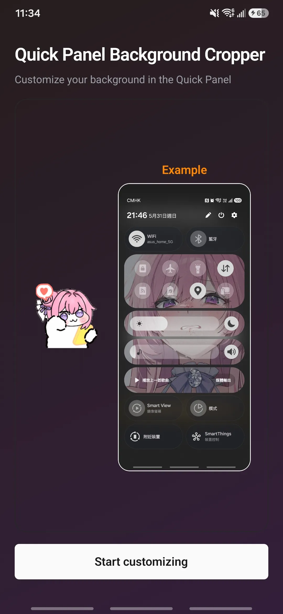
  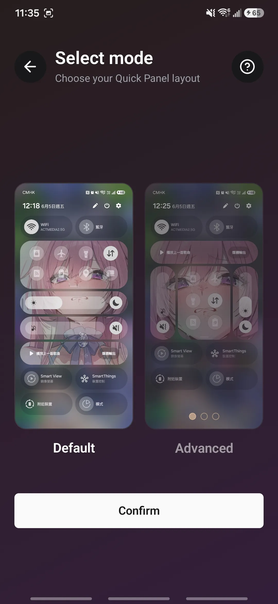
  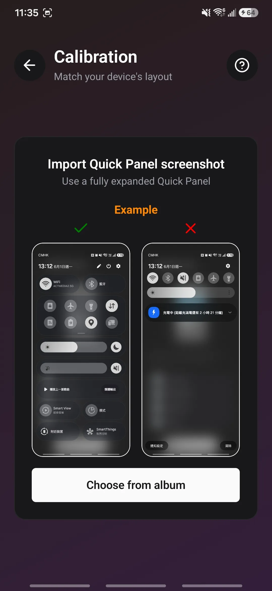
  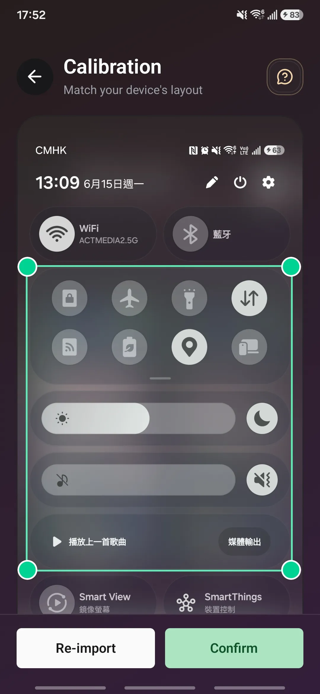
  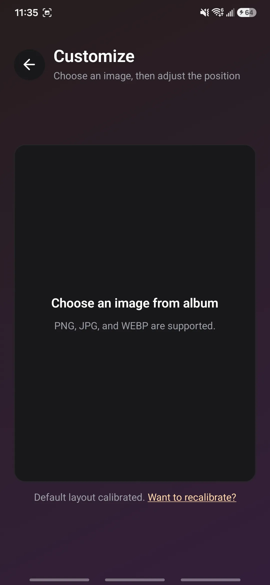
  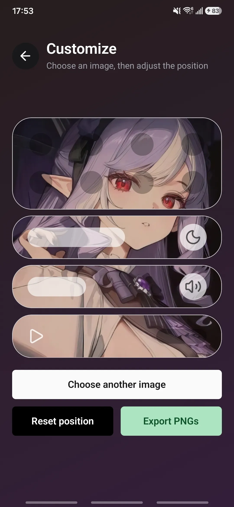
  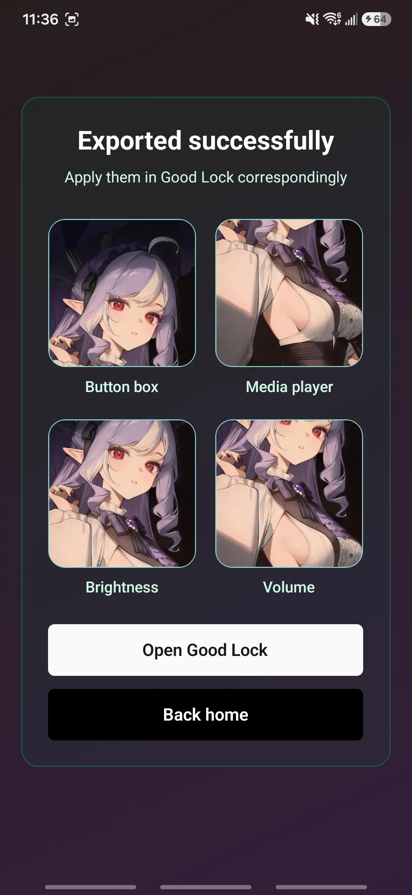
  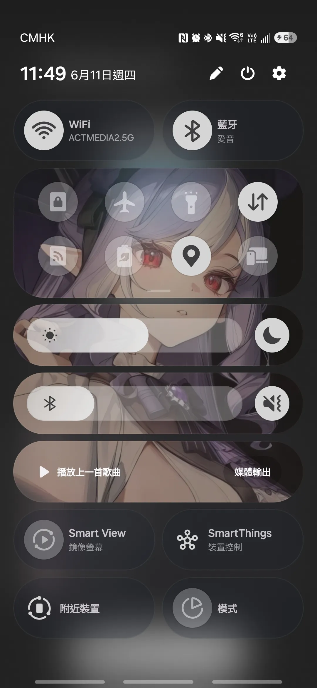
</div>

### Advanced mode

1. Press **Start customizing**.
2. Choose **Advanced** mode and press **Confirm**.
3. Import one fully expanded Quick Panel screenshot from your album.
4. Adjust the outer rectangle so it wraps the full area containing your four customizable panels.
5. Press **Next** to enter the guided panel-box steps.
6. Adjust Button box, Brightness, Volume, and Media player one by one.
7. If needed, open the snapping-grid settings during panel adjustment and change the row or column count so the box snapping matches your screenshot more closely.
8. Confirm the final four-box preview and save the layout.
9. Choose one background image from your album.
10. Pan and zoom it in the preview until the four exported slices line up the way you want.
11. Press **Export PNGs**.
12. Review the exported results and apply them in Good Lock in the shown order.

<div style="display: flex; gap: 10px; flex-wrap: wrap;">
  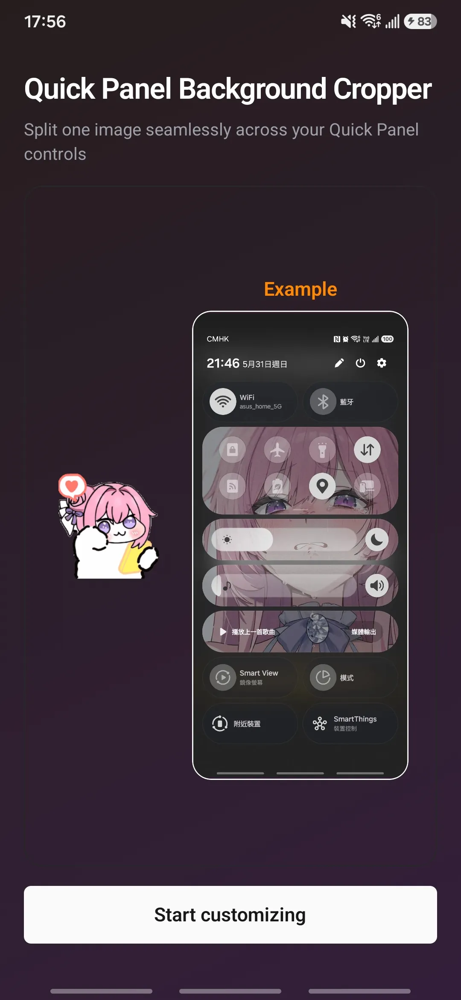
  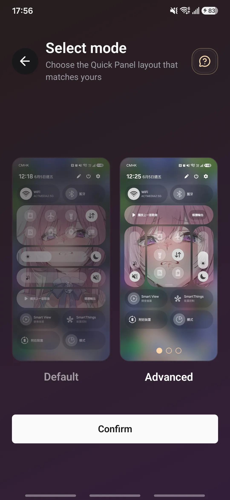
  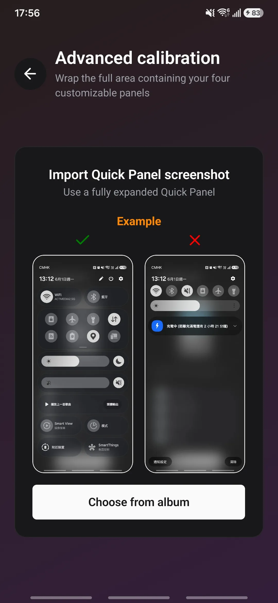
  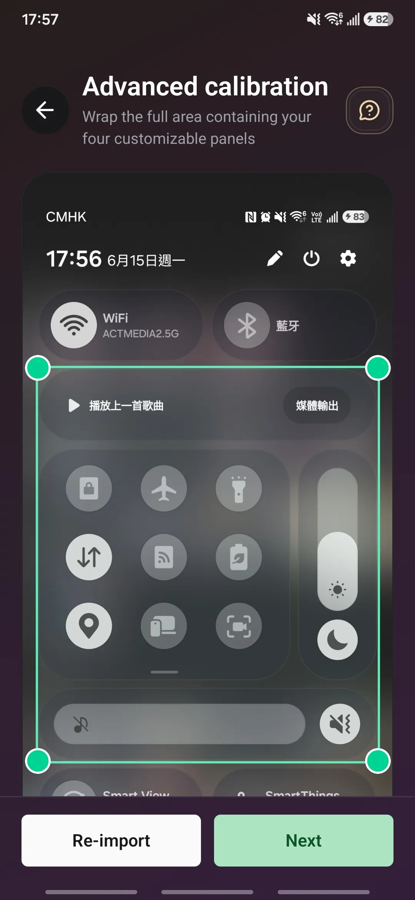
  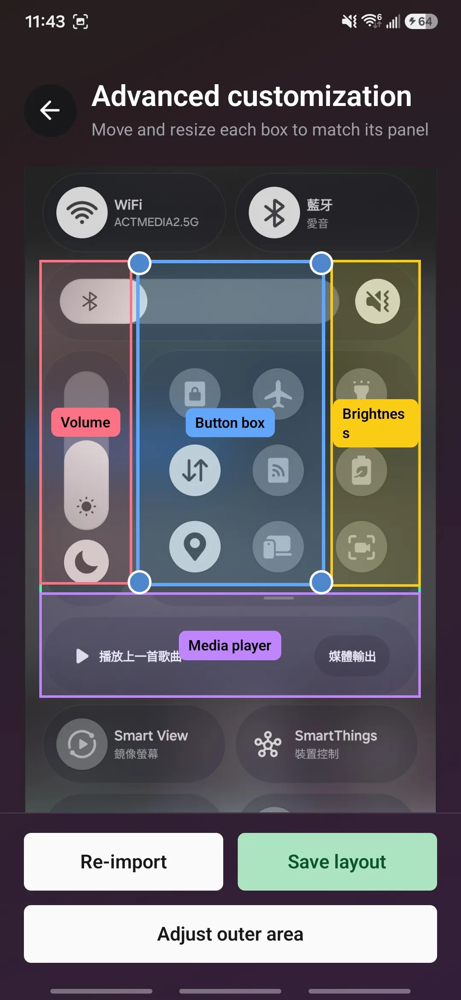
  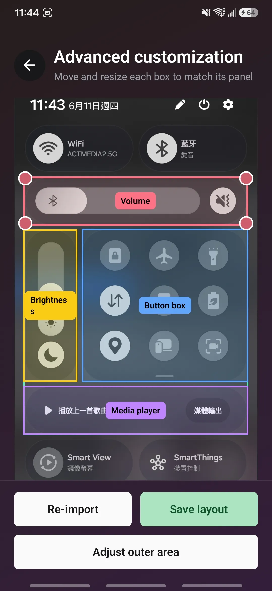
  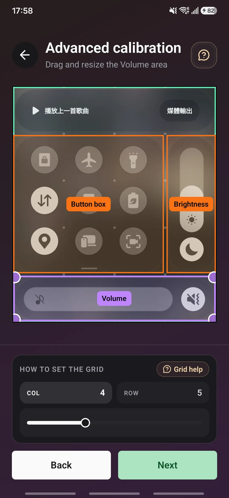
  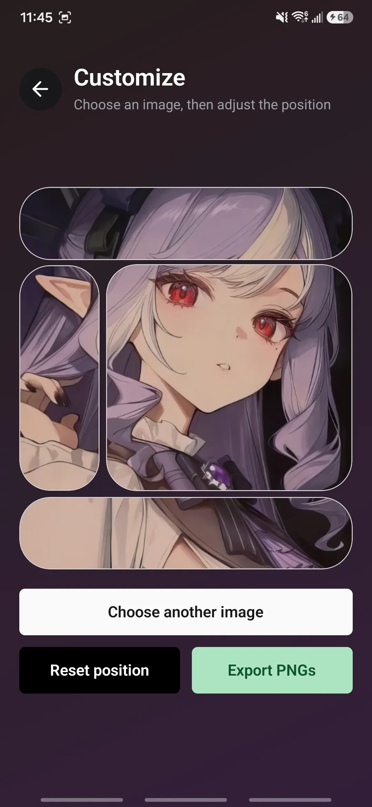
  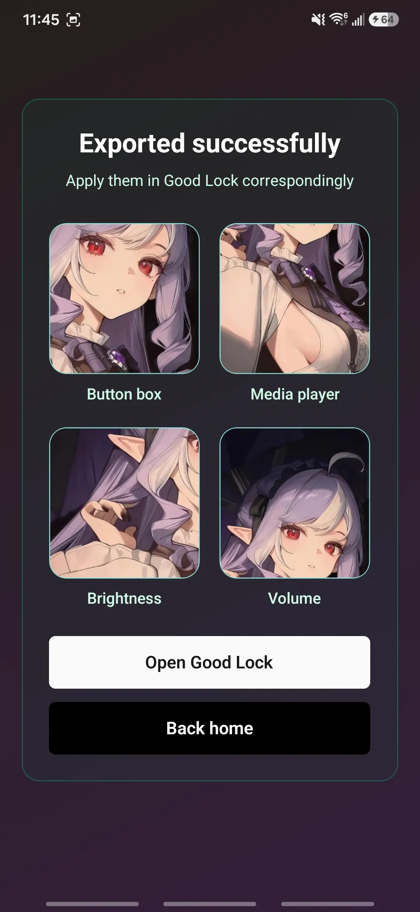
  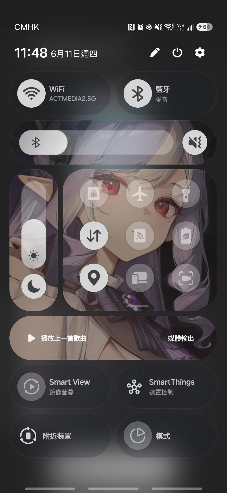
</div>

After you calibrate a mode once, later runs of that mode go straight to image selection, and you can use **Want to recalibrate?** any time to update that saved layout.

## How calibration works

Default mode adapts a Galaxy S25+ reference layout using one outer rectangle.
Advanced mode lets you mark the outer area and adjust each of the four panel
boxes independently, with an optional snapping grid to make advanced alignment
faster and more accurate on customized layouts.

The full calibration logic and assumptions are documented in [CALIBRATION_PLAN.md](/D:/quick-panel-crop-exporter/CALIBRATION_PLAN.md).

## Notes

- Use a fully expanded Quick Panel screenshot when calibrating.
- This v2 app supports only the four Good Lock Controls panels: Button box, Media player, Brightness, and Volume.
- Quick setting Buttons such as WiFi and Bluetooth are planned for v3 or later.
- Use Advanced mode when the four supported Controls panels have been rearranged or resized.
- Good Lock availability depends on Samsung support in your region and device setup.

## Development

```bash
npm install
npx expo run:android
```
