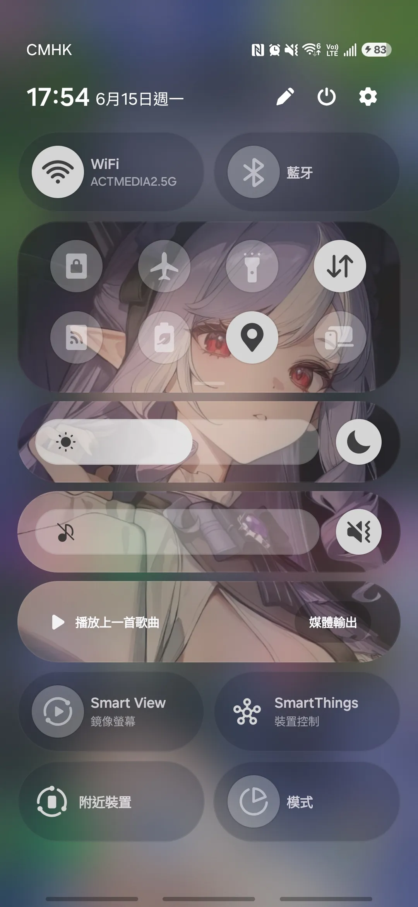
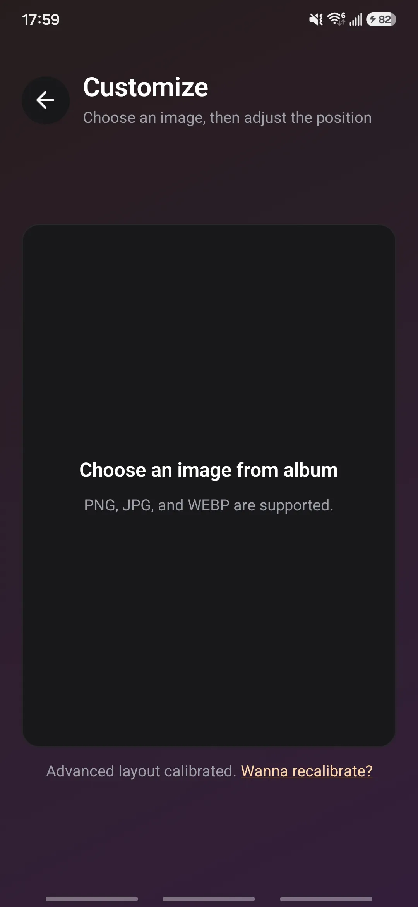
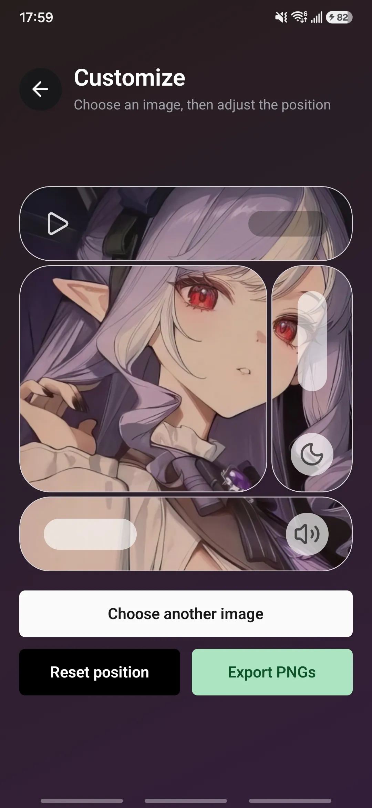
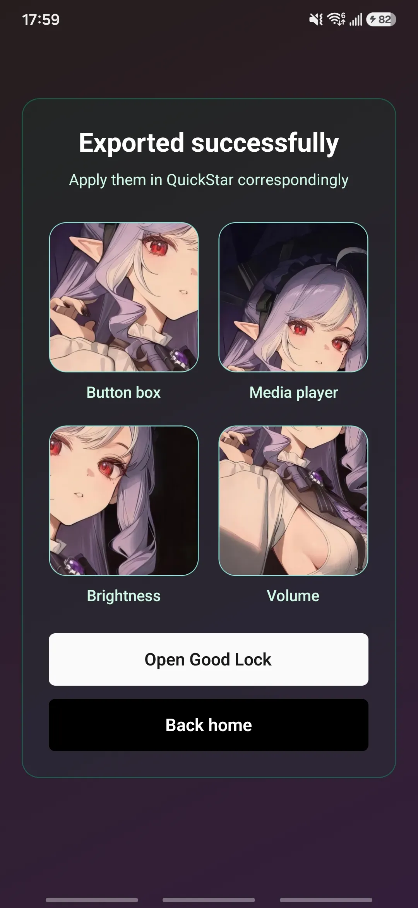
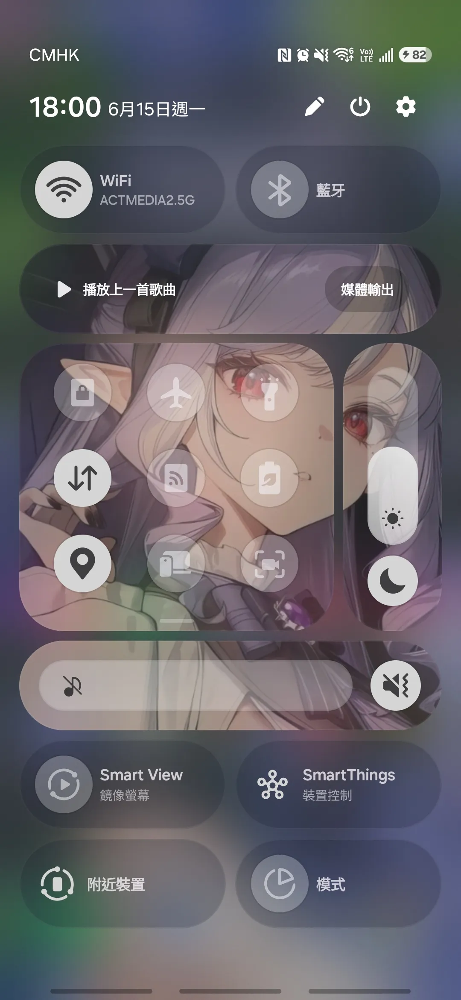

# Quick Panel Background Cropper

Create Samsung Good Lock Quick Panel background PNGs for the Controls panels from a single image.

## What it does

This app helps you turn one wallpaper or photo into the square panel images used by Samsung Good Lock's Quick Panel customization.

In v2, this app only supports the Quick Panel **Controls** tab. It can export
any selected subset of these supported panels: Button box, Media player,
Brightness, and Volume.

It includes:

- Default and Advanced layout customization modes
- one-time Quick Panel calibration using a screenshot
- live preview for the selected supported Controls panels
- pan and zoom adjustment before export
- PNG export in the same order you need to apply them in Good Lock

## Target devices

This app is only intended for:

- Samsung phones
- Android 16
- One UI 8.5
- mainly Galaxy S series and A series slab phones

## Current scope

One UI 8.5 Quick Panel customization has separate areas such as **Controls**
and **Buttons**. This app currently supports these customizable **Controls**
panels:

- Button box
- Media player
- Brightness
- Volume

The Quick setting **Buttons** panels such as WiFi and Bluetooth are not part of
v2 yet. They are planned for v3 or later. Advanced mode can now export fewer
than four Controls images when a user calibrates only the panels present in a
specific region of their layout.

Not intended for:

- Fold, Flip, or tablets
- DeX or external-display layouts
- older or different One UI versions
- Quick setting Buttons customization in Good Lock yet

## User flow

For a first-time user, the app has two setup paths:

### Default mode

1. Press **Start customizing**.
2. Choose **Default** mode and press **Confirm**.
3. Import one fully expanded Quick Panel screenshot from your album.
4. Drag the green rectangle so it wraps the whole customizable panel stack, then press **Looks good**.
5. Choose one background image from your album.
6. Pan and zoom it in the preview until the four supported Controls panels look right together.
7. Press **Export PNGs**.
8. Review the exported results and apply them in Good Lock in the shown order.

<div style="display: flex; gap: 10px; flex-wrap: wrap;">
  
  
  
  
  
  
  
  
</div>

### Advanced mode

1. Press **Start customizing**.
2. Choose **Advanced** mode and press **Confirm**.
3. Import one fully expanded Quick Panel screenshot from your album.
4. Adjust the outer rectangle so it wraps the full region you want to calibrate.
5. Turn off any supported panel that is missing from that region.
6. Set the snapping grid by changing the **Col** and **Row** counts, from 1 to 8, so box snapping matches your screenshot more closely.
7. Drag and resize each enabled panel box in guided order.
8. Confirm the selected panel-box preview and save the layout.
9. Choose one background image from your album.
10. Pan and zoom it in the preview until the enabled exported slices line up the way you want.
11. Press **Export PNGs**.
12. Review the exported results and apply them in Good Lock in the shown order.

<div style="display: flex; gap: 10px; flex-wrap: wrap;">
  
  
  
  
  
  
  
  
  
  
  
  
  
</div>

After you calibrate a mode once, later runs of that mode go straight to image selection, and you can use **Want to recalibrate?** any time to update that saved layout.

## How calibration works

Default mode adapts a Galaxy S25+ reference layout using one outer rectangle.
Advanced mode lets you mark an outer region, choose which supported Controls
panels exist inside that region, then walks through only those selected
panel-box adjustment steps in this order: Button box, Brightness, Volume, and
Media player. A configurable snapping grid inside the confirmed outer area
helps those advanced adjustments line up faster and more accurately on
customized or partial layouts.

The full calibration logic and assumptions are documented in [CALIBRATION_PLAN.md](CALIBRATION_PLAN.md).

## Notes

- Use a fully expanded Quick Panel screenshot when calibrating.
- This v2 app supports only these Good Lock Controls panels: Button box, Media player, Brightness, and Volume.
- Quick setting Buttons such as WiFi and Bluetooth are planned for v3 or later.
- Use Advanced mode when supported Controls panels have been rearranged, resized, removed, or when you only want to calibrate a specific Controls region.
- Good Lock availability depends on Samsung support in your region and device setup.

## Development

```bash
npm install
npx expo prebuild --clean
npm run android
```

This repo's default Android development flow installs a side-by-side debug app
named `QPBC dev` so you can keep the Play Store or closed-test app installed on
the same device.

- `npm run android` uses `APP_VARIANT=dev`
- the Android debug build gets the package suffix `.dev`
- `npm run build-apk` uses `APP_VARIANT=apk` and installs as `QPBC apk`
- after native config changes, run `npx expo prebuild --clean` again so the
  generated `android/` project picks up the latest config-plugin changes
