# Quick Panel Background Cropper

Create Samsung Good Lock QuickStar Quick Panel background PNGs for the Controls panels from a single image.

## What it does

This app helps you turn one wallpaper into the square panel images used by Samsung Good Lock QuickStar's Quick Panel customization.

In v2, this app only supports the Quick Panel **Controls** tab. It can export
any selected subset of these supported panels: Button box, Media player,
Brightness, and Volume.

It includes:

- Default and Advanced layout customization modes
- one-time Quick Panel calibration using a screenshot
- live preview for the selected supported Controls panels
- pan and zoom adjustment before export
- PNG export in the same order you need to apply them in Good Lock QuickStar (for English device language)

## Target devices

This app is only intended for:

- Samsung phones
- Android 16 or above
- One UI 8.5 or above
- mainly Galaxy S / A / Z series phones

## Current scope

One UI 8.5 Quick Panel customization has separate areas such as **Controls**
and **Buttons**. This app currently supports these customizable **Controls**
panels:

- Button box
- Media player
- Brightness
- Volume

The Quick setting **Buttons** panels such as WiFi and Bluetooth are not part of
v2 yet. They are planned for v3 or later.

Not intended for:

- DeX or external-display layouts
- older or different One UI versions
- Buttons panel customization

## User flow

For a first-time user, the app has two setup paths:

### Default mode

1. Press **Start customizing**.
2. Choose **Default** mode and press **Confirm**.
3. Import one fully expanded Quick Panel screenshot from your album.
4. Drag the green rectangle so it wraps the whole customizable panel stack, then press **Confirm**.
5. Choose one background image from your album.
6. Pan and zoom it in the preview until the background image reaches your desired look across the 4 Controls panels.
7. Press **Export PNGs**.
8. Review the exported results and apply them in Good Lock manually.

<div style="display: flex; gap: 10px; flex-wrap: wrap;">
  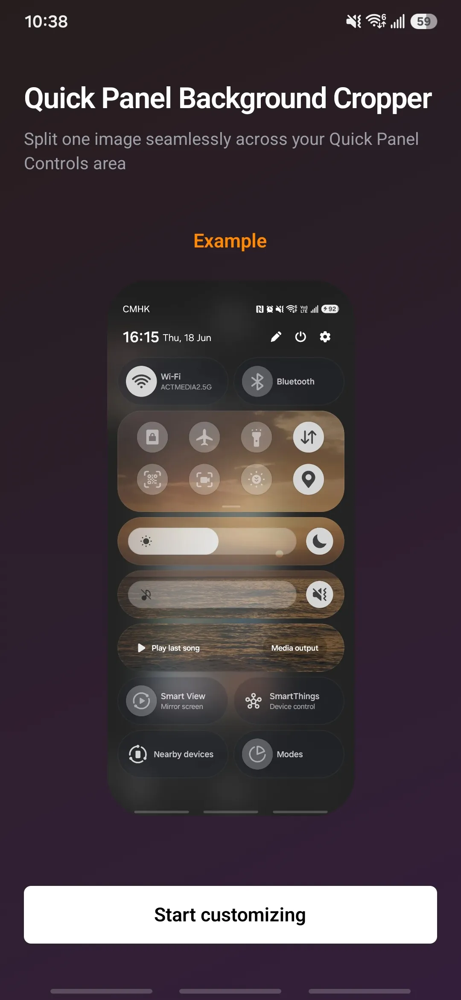
  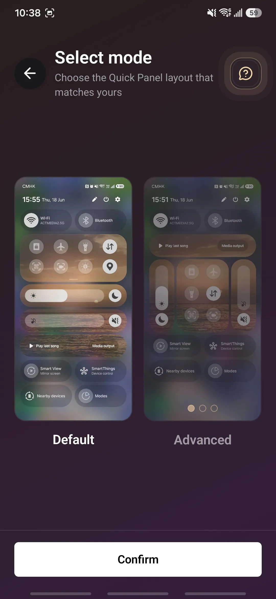
  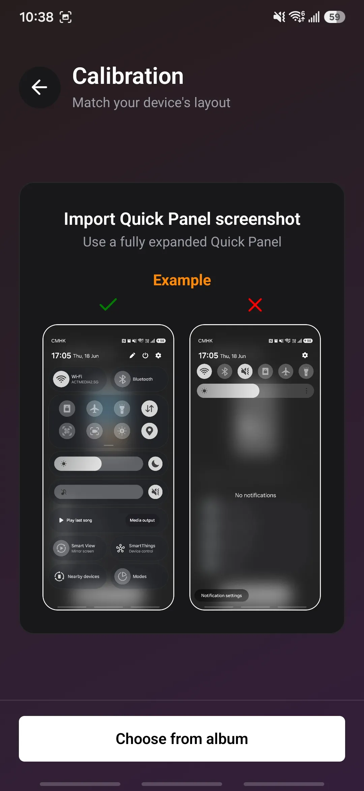
  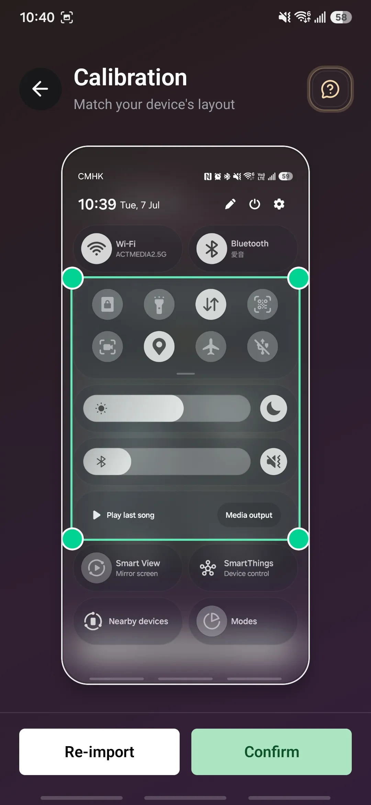
  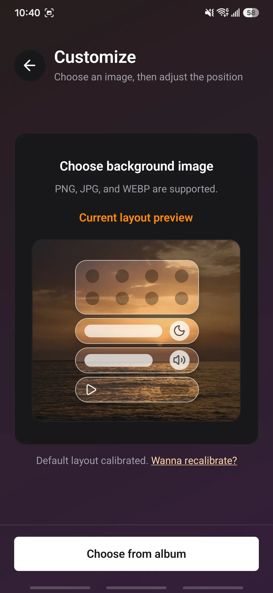
  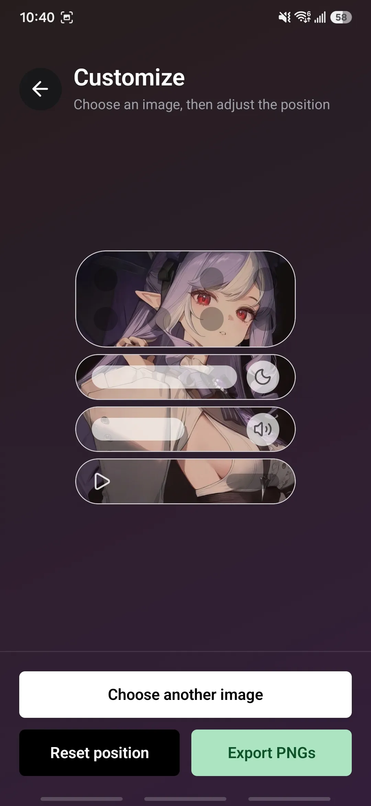
  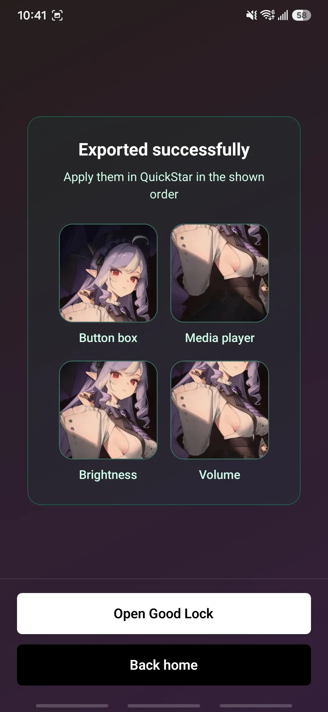
  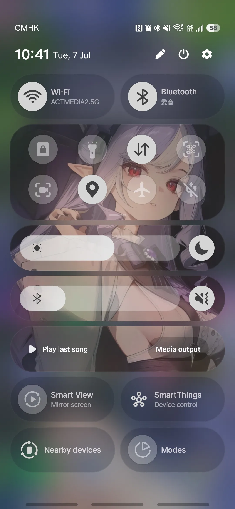
</div><br>

### Advanced mode

1. Press **Start customizing**.
2. Choose **Advanced** mode and press **Confirm**.
3. Import one fully expanded Quick Panel screenshot from your album.
4. Adjust the green rectangle so it wraps the full region you want to customize.
5. Turn off any supported panel that is missing from that region.
6. Set the snapping grid by changing the **Col** and **Row** counts, from 1 to 8, so box snapping matches your layout.
7. Drag and resize each enabled panel box in guided order: Button box,
   Brightness, Volume, and Media player.
8. Review the enabled panel boxes, then confirm to save the layout.
9. Choose one background image from your album.
10. Pan and zoom it in the preview until the background image reaches your desired look across the selected Controls panels.
11. Press **Export PNGs**.
12. Review the exported results and apply them in Good Lock manually.

<div style="display: flex; gap: 10px; flex-wrap: wrap;">
  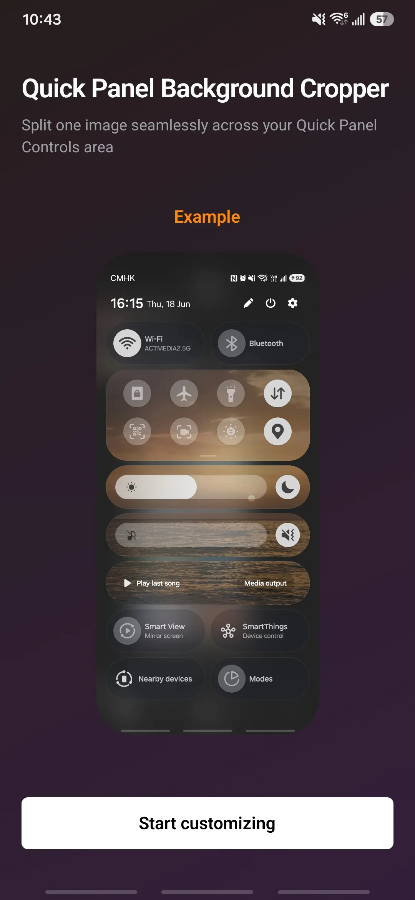
  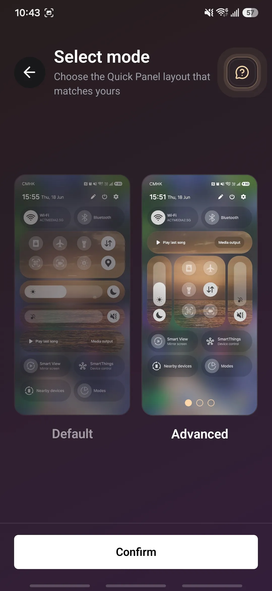
  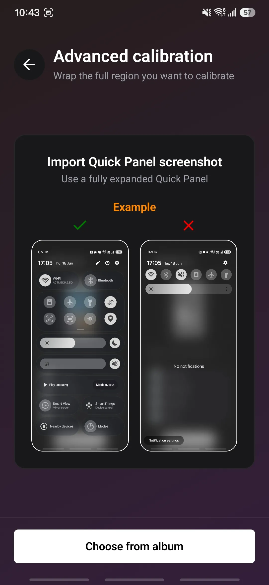
  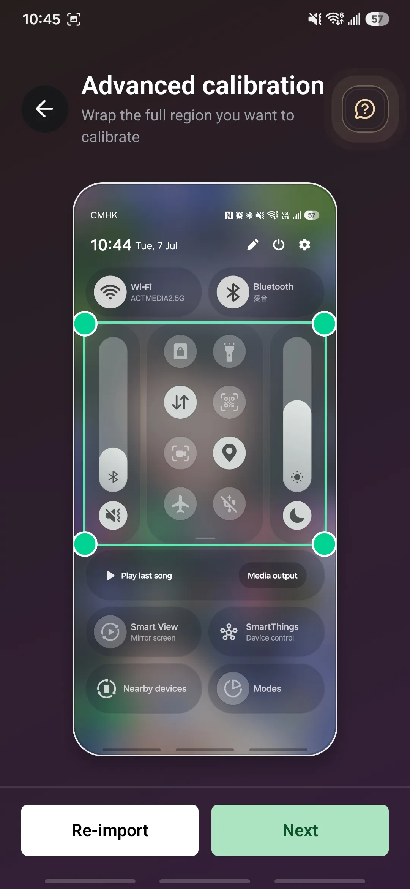
  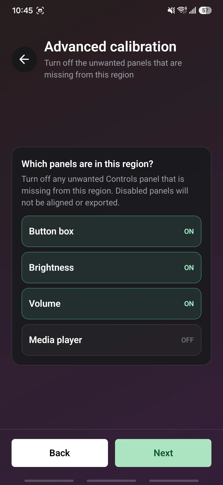
  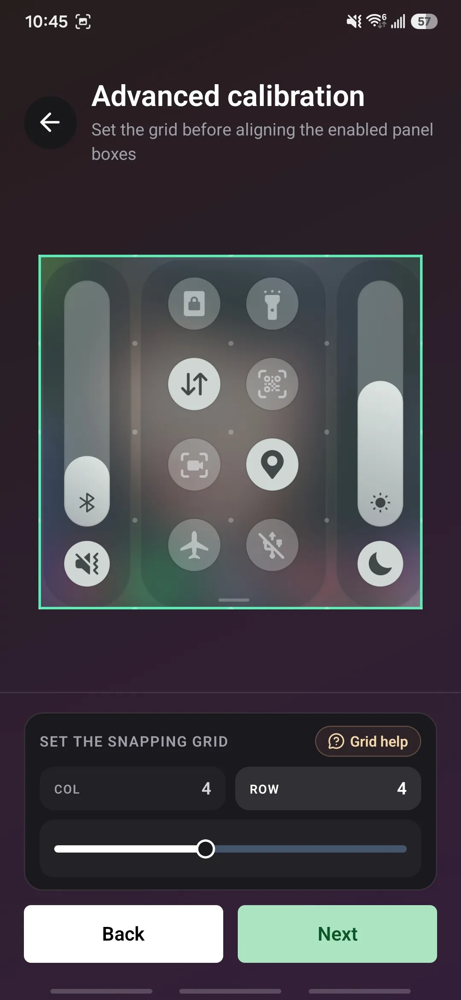
  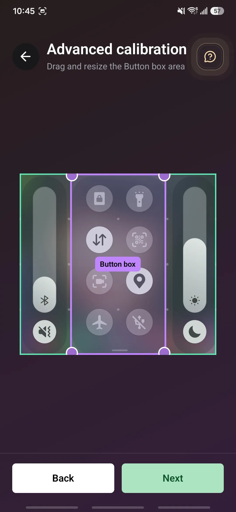
  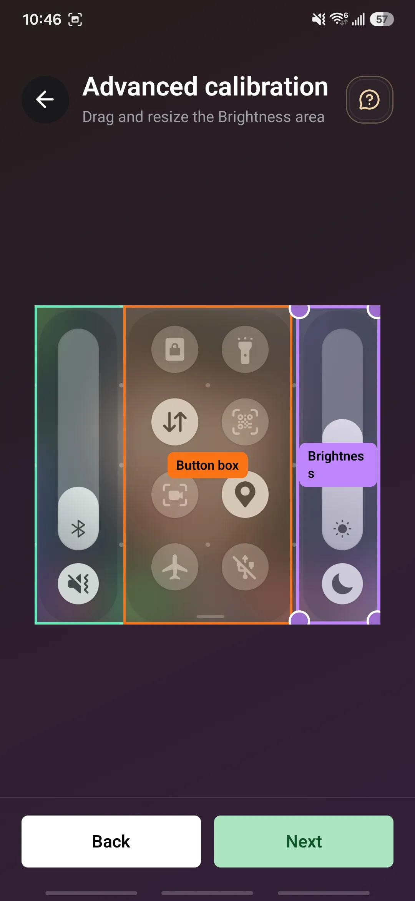
  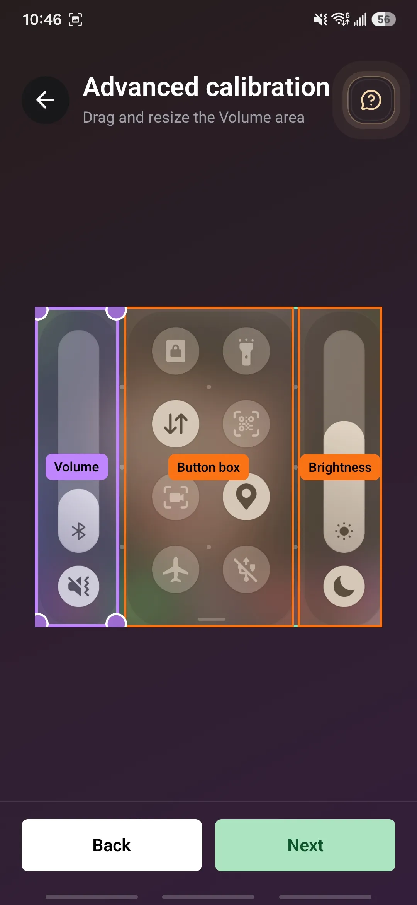
  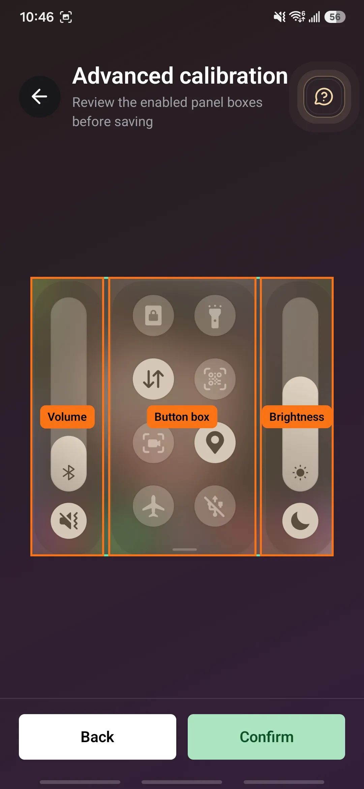
  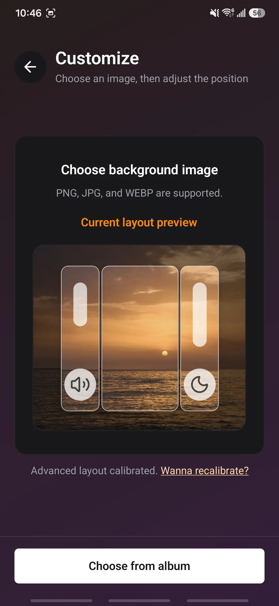
  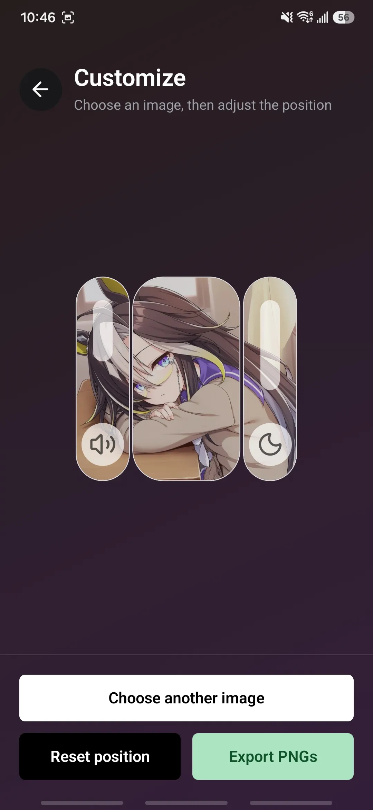
  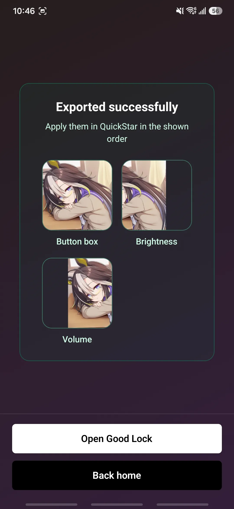
  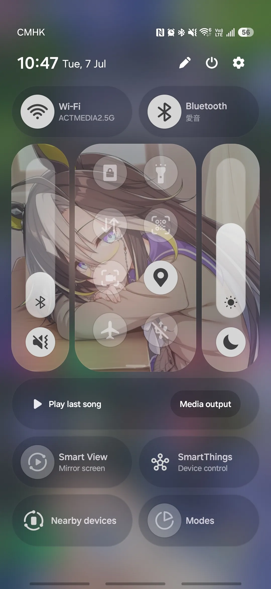
</div><br>

After you calibrate a mode once, later runs of that mode go straight to image selection, and you can use **Want to recalibrate?** any time to update that saved layout.

## How calibration works

Default mode adapts a Galaxy S25+ reference layout from one adjustable outer
rectangle.
Advanced mode first saves the outer region you want to calibrate, then asks
which supported Controls panels are present there. Disabled panels are skipped
during alignment and export. After that, you set the row and column grid, align
only the enabled panel boxes in this order: Button box, Brightness, Volume, and
Media player, then review the enabled boxes before saving the layout. The
snapping grid helps the panel boxes line up faster on customized or partial
Controls layouts.

Here are the calibration bottom sheet helpers:

<div style="display: flex; gap: 10px; flex-wrap: wrap;">
  
  
  
  
  
  
</div><br>

First-time users also get an animated helper icon on the mode-selection,
outer-calibration, advanced panel-alignment, and advanced review screens until
that specific help sheet is opened. The icon uses two soft pulse rings plus a
small wave motion to draw attention, then stays still after that helper has been seen. The animation is disabled when reduced motion is enabled.

The full calibration logic and assumptions are documented in [CALIBRATION_PLAN.md](CALIBRATION_PLAN.md).

## Notes

- Use a fully expanded Quick Panel screenshot when calibrating.
- This v2 app supports only these Good Lock Controls panels: Button box, Media player, Brightness, and Volume.
- Quick setting Buttons such as WiFi and Bluetooth are planned for v3 or later.
- Use Advanced mode when supported Controls panels have been rearranged, resized, removed, or when you only want to calibrate a specific Controls region.
- Good Lock availability depends on Samsung support in your region and device setup.

## Development

```bash
npm install
npm run android
```

This repo's default Android development flow installs a side-by-side debug app
named `QPBC dev` so you can keep the Play Store or closed-test app installed on
the same device.

- `npm run android` runs a clean Android prebuild with `APP_VARIANT=dev`, then
  installs the dev build
- the Android debug build gets the package suffix `.dev`
- `npm run build-apk` uses `APP_VARIANT=apk` and builds a release APK variant
  named `QPBC apk`
- `npm run build-beta` uses `APP_VARIANT=beta`, bumps Android `versionCode`,
  shows the build version in-app, and builds the open-beta AAB
- APK builds use `google-services/google-services-apk.json`, while beta builds
  use `google-services/google-services-open.json`
- release builds require upload-key values in `android/gradle.properties`,
  `~/.gradle/gradle.properties`, or env:
  `MYAPP_UPLOAD_STORE_FILE`, `MYAPP_UPLOAD_KEY_ALIAS`,
  `MYAPP_UPLOAD_STORE_PASSWORD`, and `MYAPP_UPLOAD_KEY_PASSWORD`
- after native config changes, run `npm run android` again so the generated
  `android/` project picks up the latest config-plugin changes
