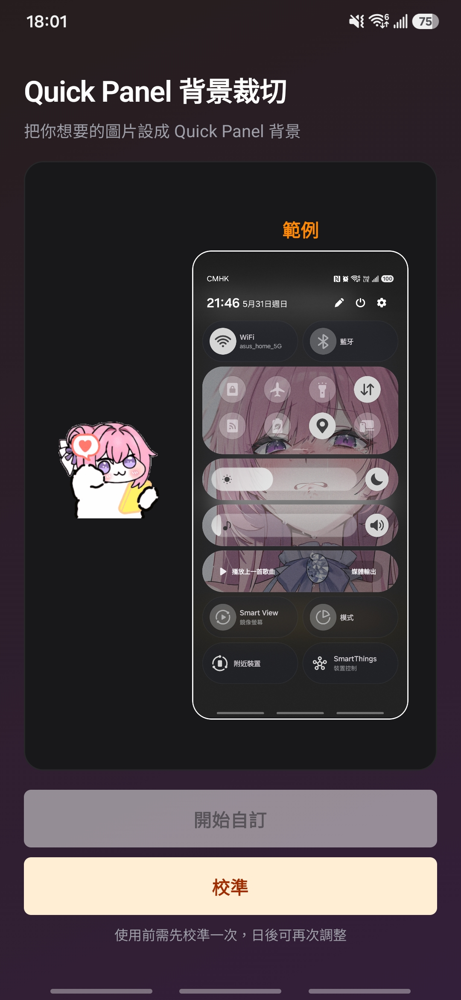
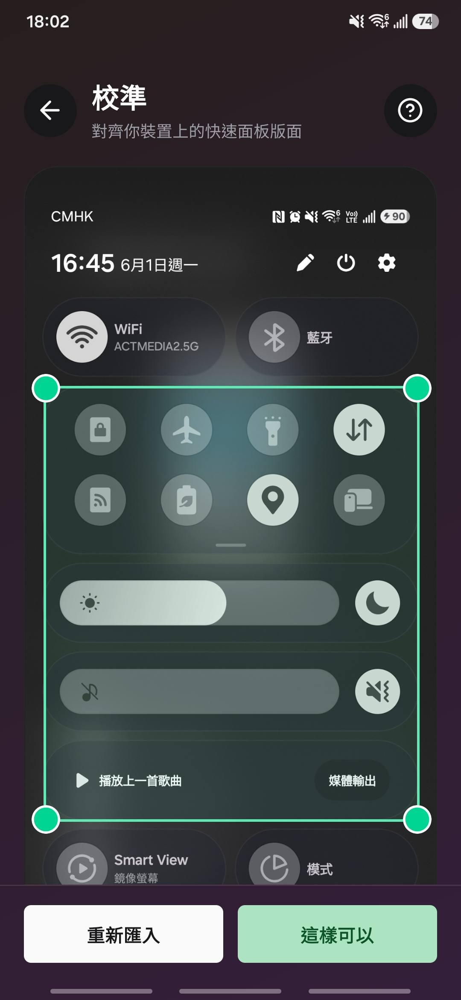
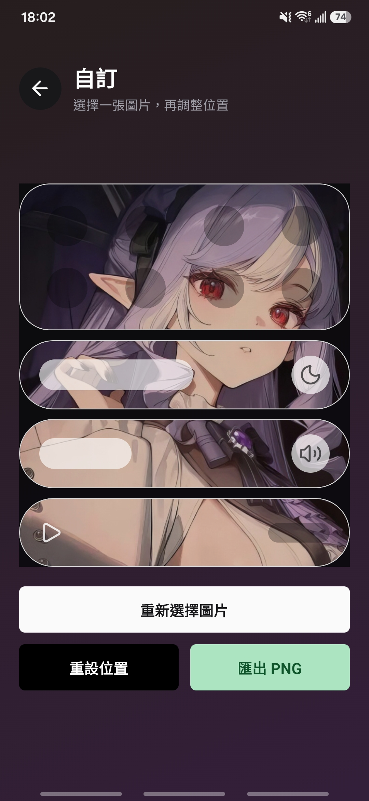
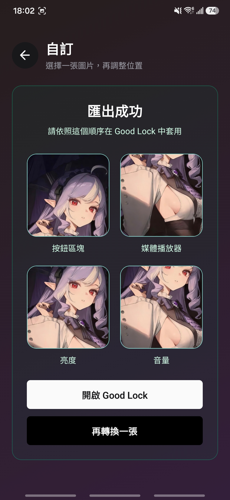

# Quick Panel Background Cropper

Create Samsung Good Lock Quick Panel background PNGs from a single image.

## What it does

This app helps you turn one wallpaper or photo into the square panel images used by Samsung Good Lock's Quick Panel customization.

It includes:

- default-layout calibration using one union box
- custom-layout calibration using one box per panel
- mode-specific calibration help for `Default layout` and `Custom layout`
- optional two-screenshot custom calibration with manual overlap alignment
- live preview for Button box, Brightness, Volume, and Media player
- pan and zoom adjustment before export
- PNG export in the same order you need to apply them in Good Lock

## Target devices

This app is only intended for:

- Samsung phones
- Android 16
- One UI 8.5
- default Quick Panel layout
- customized Quick Panel layouts that still use Button box, Brightness, Volume, or Media player
- mainly Galaxy S series and A series slab phones

Not intended for:

- Fold, Flip, or tablets
- DeX or external-display layouts
- older or different One UI versions

## User flow

1. Choose `Default layout` or `Custom layout`.
2. Import a fully expanded Quick Panel screenshot.
3. In `Default layout`, adjust one green box around the whole customizable panel stack.
4. In `Custom layout`, either continue with one screenshot or add one second screenshot and align its overlap manually.
5. In `Custom layout`, place a box for Button box, Brightness, Volume, and Media player, or mark a panel hidden.
6. Review and save calibration.
7. Saving calibration returns to one landing root instead of stacking repeated home screens.
8. Choose one image from your album.
9. Pan and zoom it in the preview.
10. Export the PNGs.
11. Apply them in Good Lock in the shown order.

## How calibration works

The app uses a Galaxy S25+ on One UI 8.5 as the base reference layout.

For `Default layout`, it scales that reference layout from one calibrated outer box.

For `Custom layout`, the help sheet now changes by mode. `Default layout` keeps the one-box guidance, while `Custom layout` uses `assets/calibrate_customized.jpg` and describes the per-panel workflow.

For `Custom layout`, the app stores the real user-provided rectangles for each visible panel and skips hidden ones during preview and export. Custom mode supports:

- one screenshot for shorter layouts
- a maximum of two screenshots for taller layouts
- manual vertical overlap alignment only

Custom layouts now model QuickStar as:

- one square source image per panel
- one centered runtime crop inside that square
- one shared background transform across all visible panels
- one saved calibration slot for `Default layout` and one saved slot for `Custom layout`

Custom-layout preview now keeps only the panel boxes and the clipped background image. It intentionally removes simulated sliders, buttons, and icons so the export model stays the source of truth for the final panel output.

That keeps preview and export aligned for retracted Button box, Brightness, Volume, and Media player layouts while leaving default-layout behavior unchanged.

The full calibration logic and assumptions are documented in [CALIBRATION_PLAN.md](./CALIBRATION_PLAN.md).

## Screenshots

<div style="display: flex; gap: 10px; flex-wrap: nowrap;">
  
  
  
  
</div>

## Notes

- Use a fully expanded Quick Panel screenshot when calibrating.
- Use `Default layout` when your Quick Panel still matches Samsung's default stack.
- Use `Custom layout` when you have moved, hidden, or resized supported Quick Panel panels.
- `Custom layout` supports at most two screenshots, and the second screenshot must be manually aligned before panel calibration starts.
- Each mode keeps its own saved calibration, so recalibrating one mode does not replace the other.
- Good Lock availability depends on Samsung support in your region and device setup.

## Development

```bash
npm install
npx expo run:android
```
